# marinature-docs

> This repository explains some features and functionalities from marinature project.

The current web app can be visited at https://marinature.tk/

### Jump quickly

- [What is Marinature](#what-is-marinature)
- [Main design features](#main-design-features)
- [Low connection friendly](#low-connection-friendly)
- [Login and Administrator zone](#login-and-administrator-zone)
- [Technical aspects](#technical-aspects)
- [Some easter eggs](#some-easter-eggs)

# What is Marinature

Marinature is a portfolio from a photographer called Marina Pujalte. She shoots mainly wildlife photography, so one can figure out where the name comes from.

The website is composed of some collections that represent photography albums, characterized by their topics. Each collection has a bunch of photos, that are separated into different pages if there are too much photos in a single album.

It focuses mainly on user interaction and experience, where the user clicks or taps and sees animations through all the website.

It has an [administration section](#login-and-administrator-zone) where the owner of the website (in this case the photographer) manages all the collections, uploads their photos and edit the descriptions. All of that without any knowledge about programming or how the website internally works, just an easy to use interface.

# Main design features

## Glass design

The hole webpage has a glass-styled theme for some elements. This gives a premium and unique look.

However, this comes at some cost. The blur that the backdrop filter css property gives, even that it has pretty good browser compatibility, it may slow down the page if there are a lot of elements using it. However, since the background is blurred on all the pages except for the main page, a nice trick can be done. The elements in front of the blurred background do not need to have this backdrop filter property, a change in background color and transparency gives the same feeling. This trick can be used when there are no other elements in the back.

## Dark mode

The website has light and dark mode. Whenever switched, the background changes, along with filters, font color and colors of some elements. All this changes are animated. There is a switch present in all pages to toggle the theme.

## Animations

The hole webpage is filled with transitions and animations with the help of [Framer motion](https://www.framer.com/motion/) library. In order to animate components between routes, [Animate Presence](https://www.framer.com/docs/animate-presence/) is used. This feature allows us to animate the mounting and unmounting components from the react three at the same time. Without this library, the unmounting animation will not be straightforward to reproduce.

However, all this animations come at some cost. At first, spring-like animations were used. This kind of animations rely on physics spring formulas (Hooke's Law) that depend on some spring parameters, not time, like regular animations ([Learn more about Spring Animations](https://blog.maximeheckel.com/posts/the-physics-behind-spring-animations/)). This animations use javascript, and they are pretty cool, but once they are scaled up and used on some low end browser, they start to lag. Since the parameters for the spring animations are fixed (once you find the "best looking animation"), one can do a cool trick. This javascript animations can be replaced with nearly identical css animations using [keyframes](https://www.w3schools.com/cssref/css3_pr_animation-keyframes.asp) and [Bezier Curves](https://cubic-bezier.com/#.17,.67,.83,.67).

So, now we know that the majority of spring-like animations in the web page are made using css only, for performance.

## Responsive

The app uses the [react-device-detect](https://github.com/duskload/react-device-detect#react-device-detect) library. This helps knowing whether the user is visiting the site from desktop, mobile, tablet etc. Some components of the app are rendered differently from mobile or desktop. However, if the desktop has a mobile shaped screen, it renders the mobile version too. But if the user visits from a mobile or tablet with an horizontal screen, it uses also the mobile version.

So, both the desktop and mobile version are responsive, but some components are better to be shown some way on mobile and some others on desktop.

For example, the header is pretty different from desktop and mobile.
On desktop, it consists of three sections, the back button, home button and dark mode and sound toggle. These are visible by default (except on homepage, where there is no back or home button).

On mobile, only the back button and a hamburguer button is visible. The hamburguer displays a small configuration zone, with home button, dark mode and sound toggle. It is styled as a scrollable notification panel like a mobile will have. The user can also close it scrolling.

There are other differences between mobile and desktop, like the layout or shape of some containers.

## Image Visualization

This component was not trivial to do. It fact, it is the most important one, as the webpage is intended to visualize images. It has two modes, the info and full screen mode.

### Info Mode

In this mode, the image is seen with its name, scientific name and description, if provided by the author of the webpage. So, an image can have this information or not. The image may take the most space possible, taking into account that the description information have to be seen and not overlapped by the image nor the borders of the card. Also, there are some more important factors, like the orientation and aspect ratio of both the image and the screen of the user. The calculation of how much space the image and the description take in the screen is mainly done with javascript, because of the parameters that it depends.

Also, this component is slightly different on desktop and mobile. The major difference is that, on desktop, it tends to have more margins and free space, also the user can navigate through the images with the keyboard keys. On mobile, the layout is more streched and the user can swipe through images. The layout is like that because mobiles tend to have an aspect ratio much pronounced that desktop, and because of that, images may appear smaller, specially horizontal images in vertical layouts and viceversa. On both approaches, there are clickable keys on the screen to navigate too.

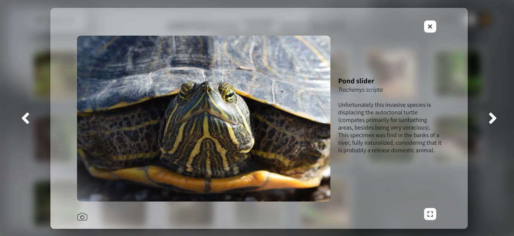
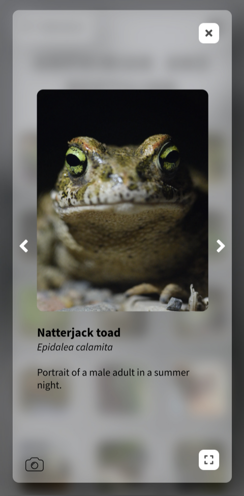

One thing to consider is that this component is not finished yet, as there are some uncommon layout combinations that can be improved, like unusual image and screen aspect ratios.

### Full Screen Mode

The little icon on the lower right opens the image in full screen mode. This makes a more immersive experience, as only the image is visualized with a blurred background. The background also changes its color depending on the image, it takes the predominant color. That is done with the help of [Color thief](https://lokeshdhakar.com/projects/color-thief/) library. The description information is not visualized in this mode. Also, the navigation can be done by swiping on mobile and with keys in the screen or keyboard on desktop.

The carrousell is made with the help of [react-image-gallery](https://github.com/xiaolin/react-image-gallery) library with some tweaks. The main tweak is that not all the images are visible when the component is mounted, unlike the library does. This helps with scroll lag on mobile, because if all the images are visible, when scrolling one, all the others are scrolled at the same time. Imagine that with about 50 high resolution images. This way, images appear dinamically when they are going to be seen, and the scrolling is much more smooth compared with the original approach.

The little camera icon on lower left opens the exif menu. This menu shows the camera settings when the image was taken. It is a pretty good feature for photographers, because sometimes they can see how the image was made and what photography lens was used. However, `.png` images or images created from scratch with an editing software like [Photoshop](https://www.adobe.com/products/photoshop.html), may not contain this information, and hence the icon is not shown. This menu has a little white shadow on info mode and dark shadow on full screen mode, to enhance contrast with the image if they overlap.

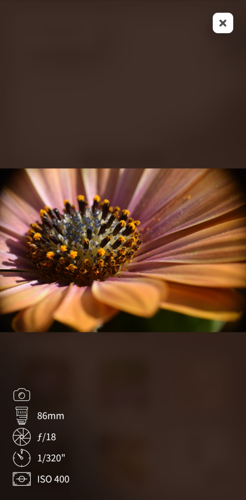

# Low connection friendly

## Website loader

The bundle of the hole website is lower than 300kB, however the user may not have a good internet connection and wait for the page to load. Also, the background image has to be considered and the information from the database. There is an animated loader for the website that dissappears when the bundle, the background image and the data from the database has been loaded.
This avoids showing the website without a background, or prevent interaction before loading the database information.

## Image compression

Whenever the owner uploads an image, several versions of that image are created. Some maintain the original aspect ratio and some others are cropped as square, the ones that act as a miniature.
Each image is sharpened using an unsharp mask (implemented via gaussian kernel and convolution), compressed and converted into .webp type, as they are intended to be seen on the web.

The following table shows all the sizes:

| Full size | Fixed Width size | Resolution name |
| :-------: | :--------------: | :-------------: |
|  LZ-FULL  |      200px       |  Lazy loading   |
|  FULL-XS  |      480px       |       SD        |
|  FULL-S   |      720px       |       HD        |
|  FULL-M   |      1080px      |     FullHD      |
|  FULL-L   |      1280px      |      WUXGA      |
|  FULL-XL  |      1440px      |     2k/QHD      |
| FULL-XXL  |      2160px      |     4k/UHD      |

| Square size |  Size   |
| :---------: | :-----: |
|    LZ-SQ    |  50x50  |
|    SQ-S     |  50x50  |
|    SQ-M     | 200x200 |
|    SQ-L     | 400x400 |

So, for each user a different image may be loaded. For example, on a 1080p screen, the M version will be loaded, and on a low-end laptop a XS may be loaded. The user gets the image that their screen needs. This helps reducing loading times, data and backend bandwidth.

Note that there is also a lazy loading version. The lazy loading is a very low quality image, around 0.5 kB for miniature and less than 3kB for the original. This leads to the following section.

## Lazy loading images

If a user has poor connectivity, an image can take some seconds to load (even after compression). So, the user is shown with a preview of the image in order to say "Hey, here is an image that is loading". This preview is the lazy loading image, that is a low quality and blurred version of the image that is loading. Once the original image is loaded, it is shown on top of the lazy loading.

# Login and Administrator zone

When entering the [Admin zone](https://marinature.tk/admin), a username and password is asked. This account is created by the web developer and no one can create accounts other than them. It is intended to be used by the photographer to manage all his collections, photos and photo descriptions.

Once they have logged in, the dashboard is shown.
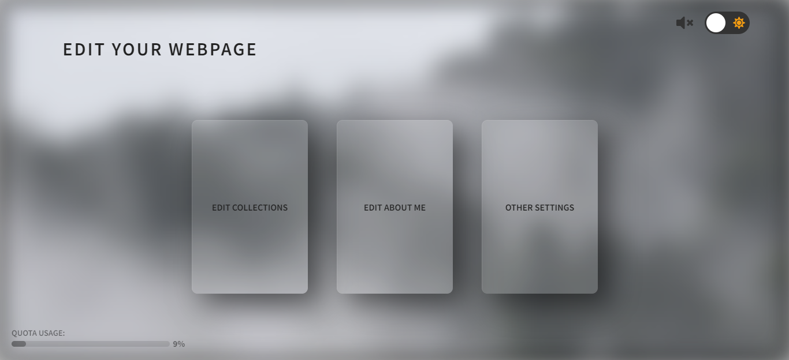

It is a simplistic menu showing three cards, where the user can edit his collections, the [About Me](https://marinature.tk/about) page and can check his quota usage. The other settings panel, for now only allows to log out, but in the future the user will be able to change the background and About Me images, along with the password of his account.

## Editing Collections

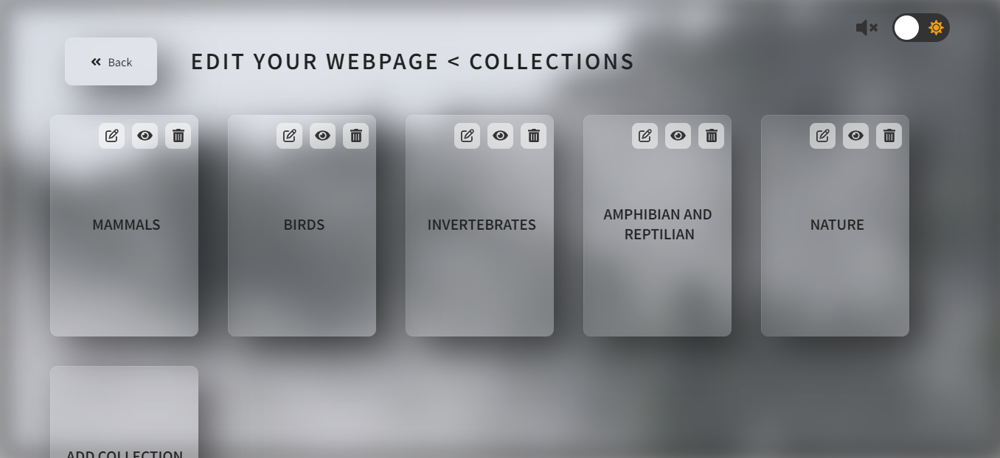

As seen in the animation above, the user can create, edit and delete collections easily. Each collection card has a menu in the upper right that allows to edit the title, hide or show the collection to the public and delete it. However, for safety reasons, the user can not delete a collection if it contains photos in it. They would have to delete the images first, and then delete the collection. If the user does not want to make a collection visible, for example because they are still uploading the images and completing the descriptions, they can just hide that collection.

The amount of collections that can be created is unlimited, however, there is a quota limit for images. This limit is about 3500 images in total. It may seem pretty limited at a first glance, however, it has to be noticed that this website is intended to show off the best images of a photographer, not an entire photo shooting session.
Even so, comparing to other photographer sites, [Flickr](https://www.flickrhelp.com/hc/en-us/articles/4404079649300-Flickr-upload-requirements#:~:text=Note%3A%20Effective%20May%201%2C%202022,to%20uploading%20only%20Safe%20content.) only allows a maximum of 1000 images in its free account, [500px](https://500px.com/terms) allows a free maximum of 2000. However, if the photographer asked for more storage, it will be provided according to the Google Cloud Storage Pricing, more explained on [Backend](#backend) section.

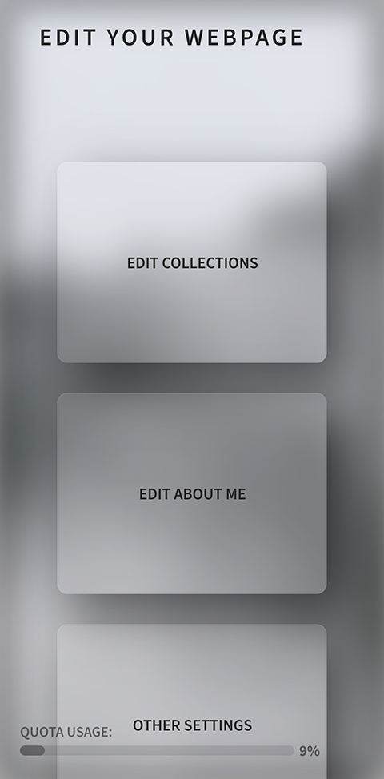
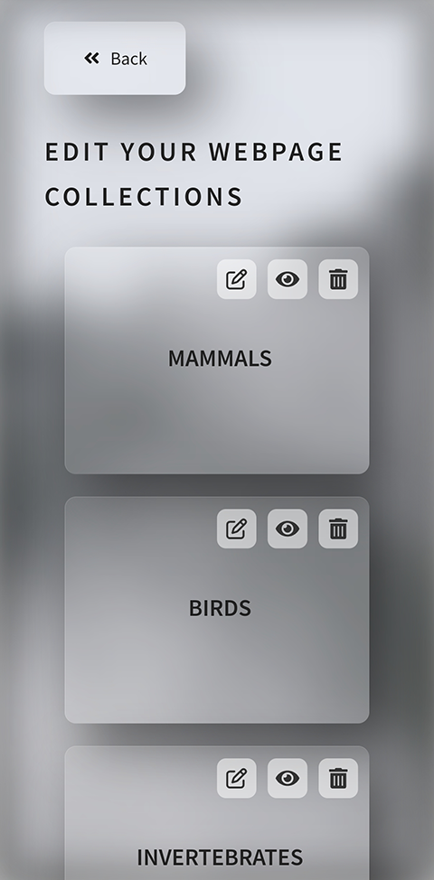

## Editing images

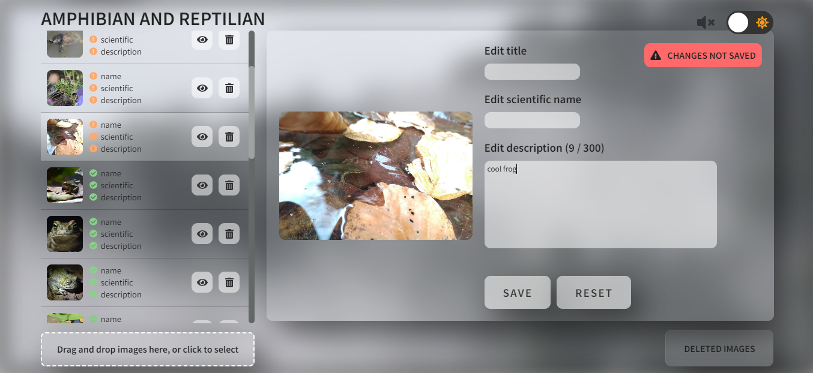

(This animation shows the interface at 2x speed).

The user can easily upload new photos in a collection by dragging them in the uploading area or by selecting them from their computer or mobile. Once they are uploaded, they are sorted by the information they have. That is, show on top the pictures that have missing information.

The photographer can fill a title, scientific name and description for each image. It is not mandatory, the layout will be shown differently depending on what information the image has. The user can write a description with up to 300 characters. It is like that to ensure the layout will always look nice when possible. The exif information about the photo is automatically scanned within the upload, and for now, it is not changable.

To save the information changed, the user must click on save button in order to sync it with the cloud, otherwise the changes will be lost. The reset button restores the last saved information. There is a information message on the top right indicating whether the changes have not been saved or they have been saved correctly. If there are no changes with respect from the cloud, it does not show any message.

On the left menu it is indicated which the information about the photo is complete. The user can select the images from this menu to start editing their information, and they can also hide the photo or delete it. The deleted images go to a trash section that is accessible in the lower right button. From there, images can be restored or deleted completely. This extra steps help deleting images quickly by mistake.

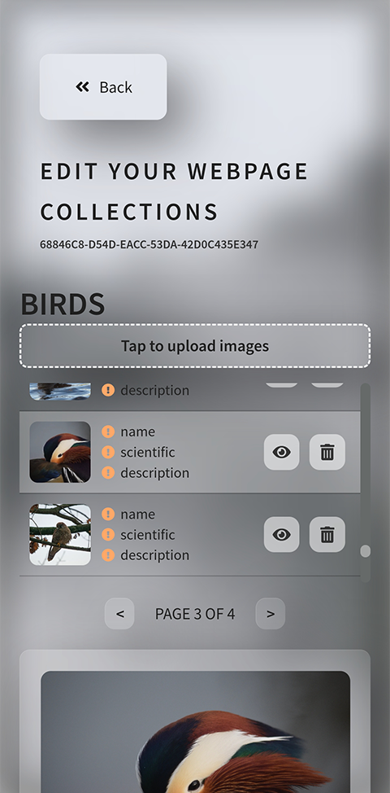
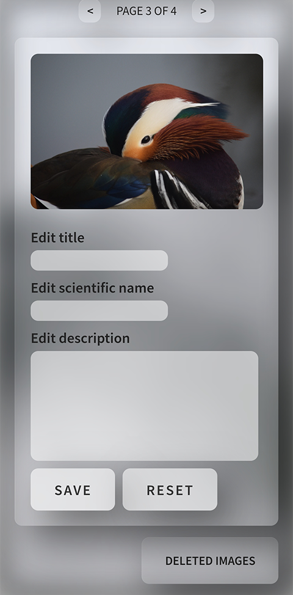

## Editing About Me

The photographer can easily edit the About Me page. They can change either the title of the page and the description about themself. The same information message about changes made (from the image edition section) is visible to show cloud status.

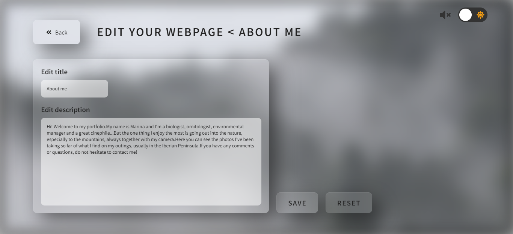

# Technical aspects

## Technologies

The app is developed with JavaScript using [ReactJs](https://reactjs.org/) library. Functional components are used. All the hosting, database and backend in more general, is made using [Firebase](https://firebase.google.com/) within its [Free Tier](https://firebase.google.com/pricing). See the [backend](#backend) section for more details.

Main libraries used in the frontend:

- [react-router-dom](https://reactrouter.com/en/main) to create routes, links and make navigation easier.
- [framer-motion](https://www.framer.com/motion/) for cool and easy animations.
- [react-fontawesome](https://fontawesome.com/v6/docs/) for cool free icons.
- [react-device-detect](https://github.com/duskload/react-device-detect) for detecting browser devices.
- [use-sound](https://github.com/joshwcomeau/use-sound), an easy hook to enable sound effects easily.
- [react-web-worker](https://www.npmjs.com/package/@shopify/react-web-worker), a cool hook from [Shopify](https://github.com/Shopify/quilt) to use web workers on react.
- [compressorjs](https://fengyuanchen.github.io/compressorjs/) for resizing and compressing images on the browser.
- [react-dropzone](https://react-dropzone.js.org/) to make the dropping area for image uploading.
- [colorthief](https://lokeshdhakar.com/projects/color-thief/) for getting a dominant color of an image fast. Used on full screen image component.
- [exifr](https://github.com/MikeKovarik/exifr) to get exif information about images on the browser.
- [gaussian-convolution-kernel](https://github.com/sidorares/gaussian-convolution-kernel) to generate a kernel for the unsharp mask, used in image compression.
- [react-image-gallery](https://github.com/xiaolin/react-image-gallery) for the slidable full screen image component.
- [react-progress-bar](https://github.com/KaterinaLupacheva/react-progress-bar) for an easy animated loading progress bar. Used when uploading images to the cloud.
- [emailjs-com](https://www.emailjs.com/) to send emails using JavaScript and in the browser.
- [react-uuid](https://github.com/RickBr0wn/react-uuid) to generate [uuid](https://en.wikipedia.org/wiki/Universally_unique_identifier)s easily.

## State

In order to handle global state or shared state with non directly related components, [React Context](https://reactjs.org/docs/context.html) is used with custom hooks. There are two different types of context, Theme context and Auth context.

The Theme context is in charge of handling light/dark mode, sound effects, the type of device and the resolution it has.

### Auth Context

The Auth context is slightly more complex. On one hand, it handles the authentication part, like the current user, login, logout, password update and reset, and email update. As explained in [Login and Administrator zone](#login-and-administrator-zone), the password update and reset and email update has not been implemented by the frontend, but they are on the backend, so a future implementation would be easy to do.

It also provides all the image data. That is, all the collections, images and their information (their dimensions, if they are hidden, deleted, etc).

Then, there are some hooks to edit the About Me page and the Collections. These include adding, updating, removing collections or images.

There is also a PopUp component that is used globally, so it can be used anywhere on the Administration zone without interference between the components that are using it.

Finally, there is a simple hook to know when the database and background images are loaded. It is used to know when to allow user interaction by removing the [loader screen](#website-loader).

## Backend

[Firebase](https://firebase.google.com/) is used as backend as a service. The services used are hosting, Firestore database, cloud storage and authentication. The architecture is oriented in **price optimization** and ease to use.

### Database

Firestore database is used in order to store all the data except for images and the web itself. Firestore works with collections and documents. Documents are small pieces of data that are intended to be read, updated or deleted quickly without interference between each other.

There are two collections in firebase, one for the image albums and other for some extra data. Then, inside the collection collections, there is a document for each image album, that contains information about the title, visibility and deletion, and also the images itself. Each image is identified uniquely by its id. Inside each image there is a bunch of information about exif, title, description, dimensions, etc.

The other data contains information of the About Me page, and the id of the last image.

### Storage

The images are stored on [Cloud Storage](https://cloud.google.com/storage) and identified by its id and resolution type (see [Image Compression section](#image-compression)). This way, the links to the images are not needed to be stored on the database, but dinamically generated depending on the id and resolution needed.

### Image identification

The id generation is optimized to not take too much storage from database. A regular [uuid](https://en.wikipedia.org/wiki/Universally_unique_identifier) could be used, but that would take 36 characters. Instead, a custom id generation is used, plus the ids generated will never be repeated.

It uses Firestore naming best practices, that is, any character not starting by a number and containing only numbers and english alphabet letters. In order to do so, the first id generated by the web will be A, then B, ..., A1, A2, ..., Aa, Ab, ..., AA, AB, ..., B1, B2, etc. Each time the id function is called, it gets a new id and updates it from Firestore Database, this way everything is in sync.

### Backend Image Compression

Firebase allows the usage of [Cloud Functions](https://cloud.google.com/functions), that are backend code that is triggered and executed. They would be a great option to make the [Image compression](#image-compression) whenever the photographer uploads new images. However, Cloud Functions are not included on Firebase Free Tier and there is a workaround.

Currently, the hole image compression process is made on the browser with the help of [compressorjs](https://fengyuanchen.github.io/compressorjs/) library. This includes resizing, cropping, filtering (convolving with unsharp mask) and making the compression iself. However, that comes at some cost, the hole webpage would freeze waiting for this process to finish. To avoid that, [web workers](https://developer.mozilla.org/en-US/docs/Web/API/Web_Workers_API/Using_web_workers) are used. JavaScript is single threaded, but with web workers, one can do background tasks without interfering with the user interface. Using web workers, the compression process may take a little bit longer, but the user can still use the webpage and see how the process goes.

## Usage of the website

As already said, the backend as a service used is free. This includes some limitations. As of October 2022, the limitations are the following:

- 10GB for **hosting** and 360MB daily hosting load. Since the bundle size of the app is about 300KB, a total approximation of 1200 users can visit the app daily according to this limit.
- 1GB for the **database** (without images) with a total of 10GB/month bandwidth, 50K daily reads and 20K daily writes. The writes are not a problem, since the photographer only updates their photos spontaneously. The reads depend on the number of collections, with 10 collections, a total of 5K daily users would be able to visit the app.
- 5GB for **storage** (the images itself). They allow about 3500 photos, taking into account that each photo contains 11 image files (see [Image Compression](#image-compression) section). The set of 11 image files weight about 1.4MB on average. A total of 1GB/day of bandwidth is allowed.

In the end, the storage limitation is the most restrictive. In the following example, the users open around 20 images on their average visit to the website. The number of daily visitors depend on the resolution that their screens are.

|  Resolution  | Storage load per visit | Number of daily visitors |
| :----------: | :--------------------: | :----------------------: |
|   720p HD    |          2MB           |           500            |
| 1080p FullHD |          3MB           |           333            |
| 1440p 2K/QHD |          4MB           |           250            |
| 2160p 4K/UHD |          12MB          |            83            |

All of the above are approximations, as each image takes different storage.

However, the users can see more images, and then the bandwidth could be higher, allowing less visitors per day.

It has to be noted that these limitations only happen when using the Firebase Free Tier. Usually a photographer would pay for their website service, and then the limitations will be the ones set by the photographer themself. The amount to be paid will be set by [Firebase Pricing](https://firebase.google.com/pricing), that, since it is intended for large scale apps, it is not very expensive.

# Some easter eggs

These easter eggs help make the icing of the cake in this website.

## Camera focus points

On the home page, in the desktop version, if the user goes over the right area of the page, some small squares will appear on hover. These squares represent focus points of a camera viewfinder. If a user clicks on a focus point, the hole webpage will make a blur-and-focus animation and reproduce a focus sound, as a professional camera does. Once clicked, that focus point turns into red, indicating that it is focused on that part.

A real camera viewfinder looks like this. (public image from [digital-photography-school.com](https://digital-photography-school.com/))

## Dark Theme sound

Whenever the user toggles the theme from light to dark, some nocturnal animal sounds are reproduced. There are a bunch of sounds and they play in random order on theme toggle.

## Draggable elements

Some glass elements, like the ones in the main page, can be dragged by the user on desktop and mobile and move them around the page. They normally come back to place, but sometimes they don't.
