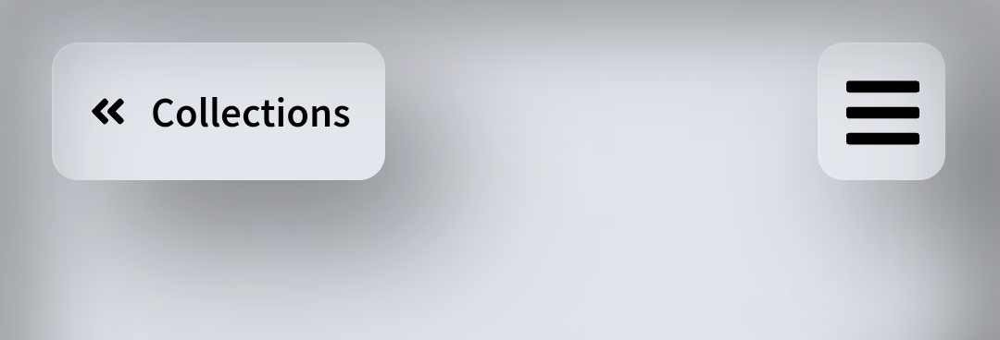
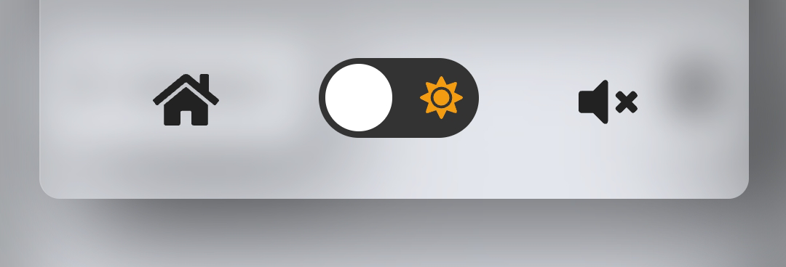

# marinature-docs

> The purpose of this repository is intended to explain some features and functionalities from marinature project.

The current web app can be visited at https://marinature.tk/

# What is marinature

Marinature is a portfolio from a photographer called Marina Pujalte. The photographer shoots mainly wildlife photography, so one can figure out where the name comes from.

The website is composed of some collections that represent photography albums, characterized by their topics. Each collection has a bunch of photos, that are separated into different pages if there are too much photos in a single album.

It focuses mainly on user interaction and experience, where the user clicks or taps and sees animations through all the website.

It has an administration section where the owner of the website (in this case the photographer) manages all his collections, uploads their photos and edit their descriptions. Without any knowledge about programming or how the website works, just an easy to use interface.

# Main features

## Glass design

The hole webpage has a glass-styled theme for some elements. This gives a premium and unique look.

However, this comes at some cost. The blur that backdrop filter css property gives, even that it has pretty good browser compatibility, it may slow down the page if there are a lot of elements using it. However, since the background is blurred on all the pages that are not the main page, a nice trick can be done. The elements in front of the blurred background do not need to have this backdrop filter property, a change in background color and transparency gives the same feeling. This trick can be used when there are no other elements in the back.

## Dark mode

The website has light and dark mode. Whenever switched, the background changes, along with filters, font color and colors of some elements. All this changes are animated. There is a switch present in all pages to toggle the theme.

## Responsive

The app uses the [react-device-detect](https://github.com/duskload/react-device-detect) library. This helps knowing whether the user is visiting the site from desktop, mobile, tablet etc. Some components of the app are rendered differently from mobile or desktop. However, if the desktop has a mobile shaped screen, it renders the mobile version too. But if the user visits from a mobile or tablet with an horizontal screen, it uses also the mobile version.

So, both the desktop and mobile version are responsive, but some components are better to be shown some way on mobile and some others on desktop.

For example, the header is pretty different from desktop and mobile.
On desktop, it consists of three sections, the back button, home button and dark mode and sound toggle. These are visible by default (except on homepage, where there is no back or home button).

On mobile, only the back button and a hamburguer button is visible. The hamburguer displays a small configuration zone, with home button, dark mode and sound toggle. It is styled as a scrollable notification panel like a mobile will have. The user can also close it scrolling.

There are other differences between mobile and desktop, like the layout or shape of some containers.

## Low connection friendly

### Website loader

The bundle of the hole website is lower than 300kB, however the user may not have a good internet connection and wait for the page to load. Also, the background image has to be considered and the information from the database. There is an animated loader for the website that dissappears when the bundle, the background image and the data from the database has been loaded.
This avoids showing the website without a background, or prevent interaction before loading the database information.

### Image compression

Whenever the owner uploads an image, several versions of that image are created. Some mantaining the original aspect ratio and some others are cropped as square, the ones that act as a miniature.
Each images are sharpened using a unsharp mask (implemented via kernel and convolution), compressed and converted into .webp type, as they are intended to be seen on the web.

The following table shows all the sizes:

| Full size | Fixed Width size | Resolution name |
| :-------: | :--------------: | :-------------: |
|  LZ-FULL  |      200px       |  Lazy loading   |
|  FULL-XS  |      480px       |       SD        |
|  FULL-S   |      720px       |       HD        |
|  FULL-M   |      1080px      |     FullHD      |
|  FULL-L   |      1280px      |      WUXGA      |
|  FULL-XL  |      1440px      |     2k/QHD      |
| FULL-XXL  |      2160px      |     4k/UHD      |

| Square size |  Size   |
| :---------: | :-----: |
|    LZ-SQ    |  50x50  |
|    SQ-S     |  50x50  |
|    SQ-M     | 200x200 |
|    SQ-L     | 400x400 |

So, for each user a different image may be loaded. For example, on a 1080p screen, the M version will be loaded, and on a low-end laptop a XS may be loaded. The user gets the image that their screen needs. This helps reducing loading times, data and backend bandwidth.

Note that there is also a lazy loading version. The lazy loading is a very low quality image, around 0.5 kB for miniature and less than 3kB for the original. This leads to the following section.

### Lazy loading images

If a user has poor connectivity, an image can take some seconds to load (even after compression). So, the user is shown with a preview of the image in order to say "Hey, here is an image that is loading". This preview is the lazy loading image, that is a low quality and blurred version of the image that is loading. Once the original image is loaded, it is shown on top of the lazy loading.

## Some easter eggs

These easter eggs help make the icing of the cake in this website.

### Camera focus points

On the home page, in the desktop version, if the user goes over the right area of the page, some small squares will appear on hover. These squares represent focus points of a camera viewfinder. If a user clicks on a focus point, the hole webpage will make a blur-and-focus animation and reproduce a focus sound, as a professional camera does. Once clicked, that focus point turns into red, indicating that it is focused on that part.

A real camera viewfinder looks like this. (public image from [digital-photography-school.com](https://digital-photography-school.com/))

