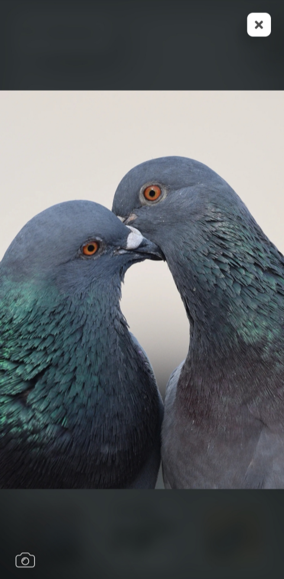

# marinature-docs

> The purpose of this repository is intended to explain some features and functionalities from marinature project.

The current web app can be visited at https://marinature.tk/

# What is marinature

Marinature is a portfolio from a photographer called Marina Pujalte. The photographer shoots mainly wildlife photography, so one can figure out where the name comes from.

The website is composed of some collections that represent photography albums, characterized by their topics. Each collection has a bunch of photos, that are separated into different pages if there are too much photos in a single album.

It focuses mainly on user interaction and experience, where the user clicks or taps and sees animations through all the website.

It has an administration section where the owner of the website (in this case the photographer) manages all his collections, uploads their photos and edit their descriptions. Without any knowledge about programming or how the website works, just an easy to use interface.

# Main features

## Glass design

The hole webpage has a glass-styled theme for some elements. This gives a premium and unique look.

However, this comes at some cost. The blur that backdrop filter css property gives, even that it has pretty good browser compatibility, it may slow down the page if there are a lot of elements using it. However, since the background is blurred on all the pages except for the main page, a nice trick can be done. The elements in front of the blurred background do not need to have this backdrop filter property, a change in background color and transparency gives the same feeling. This trick can be used when there are no other elements in the back.

## Dark mode

The website has light and dark mode. Whenever switched, the background changes, along with filters, font color and colors of some elements. All this changes are animated. There is a switch present in all pages to toggle the theme.

## Animations

The hole webpage is filled with transitions and animations with the help of [Framer motion](https://www.framer.com/motion/) library. In order to animate components between routes, [Animate Presence](https://www.framer.com/docs/animate-presence/) is used. This feature allows us to animate the mounting and unmounting components from the react three at the same time. Without this library, the unmounting animation will not be straightforward to reproduce.

However, all this animations come at some cost. At first, spring-like animations were used. This kind of animations rely on physics spring formulas (Hooke's Law) that depend on some spring parameters, not time, like regular animations ([Learn more about Spring Animations](https://blog.maximeheckel.com/posts/the-physics-behind-spring-animations/)). This animations use javascript, and they are pretty cool, but once they are scaled up and used on some low end browser, they start to lag. Since the parameters for the spring animations are fixed (once you find the "best looking animation"), one can do a cool trick. This javascript animations can be replaced with nearly identical css animations using Bezier Curves.

So, now we know that the majority of spring-like animations in the web page are made using css only, for performance.

## Responsive

The app uses the [react-device-detect](https://github.com/duskload/react-device-detect) library. This helps knowing whether the user is visiting the site from desktop, mobile, tablet etc. Some components of the app are rendered differently from mobile or desktop. However, if the desktop has a mobile shaped screen, it renders the mobile version too. But if the user visits from a mobile or tablet with an horizontal screen, it uses also the mobile version.

So, both the desktop and mobile version are responsive, but some components are better to be shown some way on mobile and some others on desktop.

For example, the header is pretty different from desktop and mobile.
On desktop, it consists of three sections, the back button, home button and dark mode and sound toggle. These are visible by default (except on homepage, where there is no back or home button).

On mobile, only the back button and a hamburguer button is visible. The hamburguer displays a small configuration zone, with home button, dark mode and sound toggle. It is styled as a scrollable notification panel like a mobile will have. The user can also close it scrolling.

There are other differences between mobile and desktop, like the layout or shape of some containers.

## Image Visualization

This component was not trivial to do. It fact, it is the most important one, as the webpage is intended to visualize images. It has two modes, the normal and fullscreen mode.

### Normal Mode

In the normal mode, the image is seen with its name, scientific name and description, if provided by the author of the webpage. So, an image can have this information or not. In this mode, the image may take the most space possible, taking into account that the description information have to be seen and not overlapped by the image nor the borders of the card. Also, there are some more important factors, like the orientation and aspect ratio of both the image and the screen of the user. The calculation of how much space the image and the description take in the screen is mainly done with javascript, because of the parameters that it depends.

Also, this component is slightly different on desktop and mobile. The major difference is that, on desktop, it tends to have more margins and free space, also the user can navigate through the images with the keyboard keys. On mobile, the layout is more streched and the user can scroll through images. The layout is like that because mobiles tend to have an aspect ratio much pronounced that desktop, and because of that, images may appear smaller, specially horizontal images in vertical layouts and viceversa. On both approaches, there are clickable keys on the screen to navigate too.

One thing to consider is that this component is not finished yet, as there are some not common layout combinations that can be improved, like unusual image and screen aspect ratios.

### Full Screen Mode

The little icon on the lower right opens the image in full screen mode. This makes a more immersive experience, as only the image is visualized with a blurred background. The background also changes its color depending on the image, it takes the predominant color. That is done with the help of [Color thief](https://lokeshdhakar.com/projects/color-thief/) library. The description information is not visualized in this mode. Also, the navigation can be done by scrolling on mobile and with keys in the screen or keyboard on desktop. The carrousell is made with the help of [react-image-gallery](https://github.com/xiaolin/react-image-gallery) library with some tweaks. The main tweak is that not all the images are visible when the component is mounted, unlike the library does. This helps with scroll lag on mobile, because if all the images are visible, when scrolling one, all the others are scrolled at the same time. Imagine that with about 50 images with great resolution. This way, images appear dinamically when they are going to be seen, and the scrolling is much more smooth compared with the original approach.

The little camera icon on lower left opens the exif menu. This menu shows the camera settings when the image was taken. It is a pretty good option for photographers, because sometimes they can see how the image was made and what photography lens was used. However, `.png` images or images created from scratch with an editing software like Photoshop, may not contain this information, and hence the icon is not shown. This menu has a little white shadow on normal mode and dark shadow on full screen mode, to enhance contrast with the image if they overlap.

## Login and Administrator zone

When entering the [Admin zone](https://marinature.tk/admin), a username and password is asked. This account is created by the web developer and no one can create accounts other than them. It is intended to be used by the photographer to manage all his collections, photos and photo descriptions.

Once the user has logged in, the dashboard is shown.

# Low connection friendly

## Website loader

The bundle of the hole website is lower than 300kB, however the user may not have a good internet connection and wait for the page to load. Also, the background image has to be considered and the information from the database. There is an animated loader for the website that dissappears when the bundle, the background image and the data from the database has been loaded.
This avoids showing the website without a background, or prevent interaction before loading the database information.

## Image compression

Whenever the owner uploads an image, several versions of that image are created. Some mantaining the original aspect ratio and some others are cropped as square, the ones that act as a miniature.
Each images are sharpened using a unsharp mask (implemented via kernel and convolution), compressed and converted into .webp type, as they are intended to be seen on the web.

The following table shows all the sizes:

| Full size | Fixed Width size | Resolution name |
| :-------: | :--------------: | :-------------: |
|  LZ-FULL  |      200px       |  Lazy loading   |
|  FULL-XS  |      480px       |       SD        |
|  FULL-S   |      720px       |       HD        |
|  FULL-M   |      1080px      |     FullHD      |
|  FULL-L   |      1280px      |      WUXGA      |
|  FULL-XL  |      1440px      |     2k/QHD      |
| FULL-XXL  |      2160px      |     4k/UHD      |

| Square size |  Size   |
| :---------: | :-----: |
|    LZ-SQ    |  50x50  |
|    SQ-S     |  50x50  |
|    SQ-M     | 200x200 |
|    SQ-L     | 400x400 |

So, for each user a different image may be loaded. For example, on a 1080p screen, the M version will be loaded, and on a low-end laptop a XS may be loaded. The user gets the image that their screen needs. This helps reducing loading times, data and backend bandwidth.

Note that there is also a lazy loading version. The lazy loading is a very low quality image, around 0.5 kB for miniature and less than 3kB for the original. This leads to the following section.

## Lazy loading images

If a user has poor connectivity, an image can take some seconds to load (even after compression). So, the user is shown with a preview of the image in order to say "Hey, here is an image that is loading". This preview is the lazy loading image, that is a low quality and blurred version of the image that is loading. Once the original image is loaded, it is shown on top of the lazy loading.

# Some technical aspects

## Main technologies

TODO React, other useful libraries, firebase

## State

TODO react context

## Backend

TODO There might be more things

# Some easter eggs

These easter eggs help make the icing of the cake in this website.

## Camera focus points

On the home page, in the desktop version, if the user goes over the right area of the page, some small squares will appear on hover. These squares represent focus points of a camera viewfinder. If a user clicks on a focus point, the hole webpage will make a blur-and-focus animation and reproduce a focus sound, as a professional camera does. Once clicked, that focus point turns into red, indicating that it is focused on that part.

A real camera viewfinder looks like this. (public image from [digital-photography-school.com](https://digital-photography-school.com/))

## Dark Theme sound

Whenever the user toggles the theme from light to dark, some nocturnal animal sounds are reproduced. There are a bunch of sounds and they play in random order on theme toggle.

## Draggable elements

Some glass elements, like the ones in the main page, can be dragged by the user on desktop and mobile and move them around the page. They normally come back to place, but sometimes they don't.
